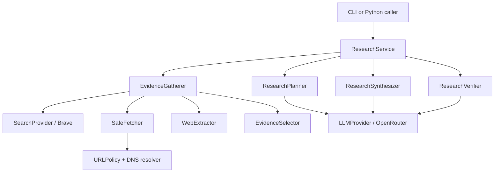

# Architecture

> Generated with `ai-craftkit` skill: `archdoc`  
> Source: `https://github.com/stefanrossmeier/safe-web-research` (commit not inspected)  
> Prompt: `inspect this repo and generate the documentation`

Last Reviewed Scope: full review
Doc Status: DRAFT
Last Architecture Update: 2026-09-20 (exact UTC time unavailable)
Updated By: agent
Source Basis: architecture/threat-model docs and source scan; no commands executed

## Purpose And Boundary

The system performs bounded public-web research. It is deliberately not a browser agent or a general action agent: planner, synthesizer, and verifier models receive structured LLM requests but no arbitrary search, fetch, shell, filesystem, browser, or downstream-action tools. Trusted Python is the authority boundary.

## Static Structure

## Layers And Ownership

| Layer | Main components | Owns |
|---|---|---|
| Domain | `domain/` strict Pydantic models | Normalized request/result schemas, evidence/source identity, security events, and budgets |
| Orchestration | `research/` | Stage sequencing, LLM and fetch budget accounting, evidence gathering/selection, provenance resolution, quality flags |
| Network | `fetch/` | URL policy, DNS resolution, validated-address connection binding, redirect/content/body limits |
| Providers | `search/`, `llm/` | Brave and OpenRouter wire details behind neutral protocols |
| Content | `extraction/`, `security/` | Static extraction; suspicious-content findings as observability events |
| Adapters | `cli.py` | Environment-based composition, argument parsing, output, and process exit code |

## Main Runtime Flow

1. A caller creates `ResearchRequest`; strict models validate question, domains, filters, and hard budget values.
2. `ResearchService` reserves an LLM call when budget permits. `ResearchPlanner` returns a structured `ResearchPlan`; otherwise the question is used as the query.
3. `EvidenceGatherer` calls `SearchProvider`, validates and fetches each candidate through `SafeFetcher`, then statically extracts text.
4. The gatherer records source/evidence provenance, scans extracted text for suspicious patterns, deduplicates URLs/content, and uses deterministic selection/stopping below hard ceilings.
5. `ResearchSynthesizer` returns a structured answer, claims, conflicts, and model-facing evidence references. Trusted code resolves those references against gathered evidence.
6. When enabled and budget allows, `ResearchVerifier` evaluates every claim only against its cited evidence; trusted code validates claim/evidence reference scope.
7. The service returns `ResearchResult`, including evidence, sources, security events, aggregate usage, and explicit incompleteness reasons.

## Security And Trust Boundaries

| Boundary | Enforced behavior | Status |
|---|---|---|
| Caller to domain models | Unexpected fields and invalid values are rejected; domains are normalized | verified |
| Model to orchestration | Models propose structured data; they do not execute arbitrary tools | verified |
| Search result to fetcher | Result URLs still pass URL/DNS/IP checks | verified |
| DNS validation to connection | HTTP connects to a validated address while preserving logical host/SNI | verified |
| Redirect | Auto-following is disabled; each target loops through full validation | verified |
| Response body | Only allowed content types and `identity`/`gzip`; bytes are bounded and malformed gzip fails closed | verified |
| Model reference to provenance | Canonical IDs are created/resolved in trusted code; unknown or out-of-scope references fail validation | verified |
| Scanner finding | Produces security observability only; does not authorize/block evidence by itself | verified |

## Data Ownership

- `ResearchRequest` owns caller constraints and a versioned `api_version: "v1"` field.
- `Source` and `EvidenceChunk` are created from fetched/extracted content and constitute canonical provenance.
- `EvidenceBundle` is the pre-synthesis immutable-style transfer object for queries, selected evidence, events, usage, and quality flags.
- `ResearchResult` owns the final answer, claims, sources/evidence, conflicts, verification outcomes, events, usage, and incompleteness reasons.
- Provider adapters normalize external responses into domain models; core orchestration must not depend on provider-native identifiers or response shapes.

## Resource Control

`ResearchBudget` is a per-request hard ceiling. Defaults documented in `docs/architecture.md` and `docs/cli.md` include 10 searches, 40 fetch attempts, 20 successful pages, 5 MB per page, 50 MB total fetch bytes, 5 redirects, 10 LLM calls, 500,000 input tokens, and 50,000 output tokens. `EvidenceSelector` is the separate soft sufficiency layer; it can stop ordinary work early but does not override a hard budget.

## External Dependencies

| Dependency | Architectural role |
|---|---|
| Brave Search | Discovery provider through `BraveSearchProvider` |
| OpenRouter | LLM completion/structured-output provider through `OpenRouterLLMProvider` |
| `httpx` | HTTP client transport used by fetcher and OpenRouter adapter |
| Beautiful Soup | Static HTML/text extraction support |
| Pydantic and `jsonschema` | Strict internal validation and local LLM structured-output validation |

## Durable Decisions

The ADRs record the core choices: bounded orchestration (`0001`), provider abstractions (`0002`), SSRF target validation (`0003`), indirect prompt-injection containment (`0004`), semantic claim verification (`0005`), evidence sufficiency/budgets (`0006`), and bounded HTTP content decoding (`0007`).

## Change Impact

- Changing any model capability or adding an external action requires threat-model and ADR review.
- Changing fetch, resolver, URL, or decoding code requires adversarial SSRF/response-limit regression coverage.
- Changing prompts/schemas/reference mapping requires provenance and verification tests.
- Changing budget/selection behavior requires unit tests plus review of benchmark semantics.

## Known Unknowns

- The package assumes a non-compromised host runtime; egress controls, isolation, secret management, filesystem restrictions, and resource limits are deployment responsibilities.
- No production deployment topology was found in the inspected repository files.
